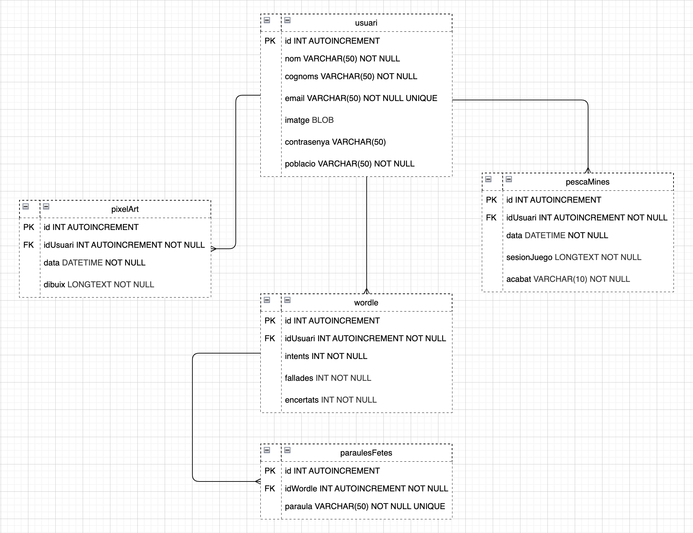
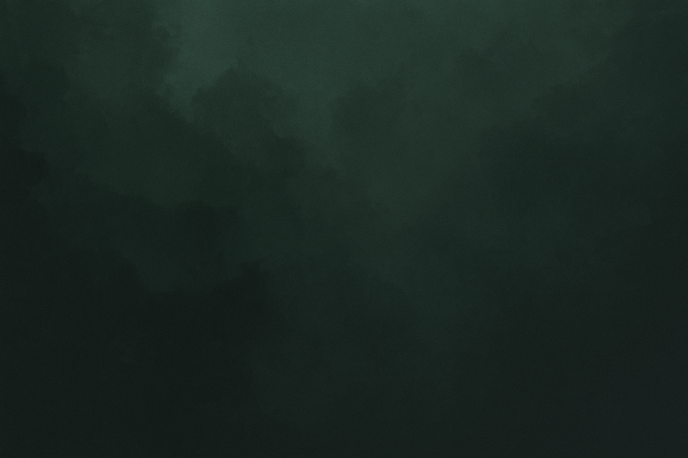
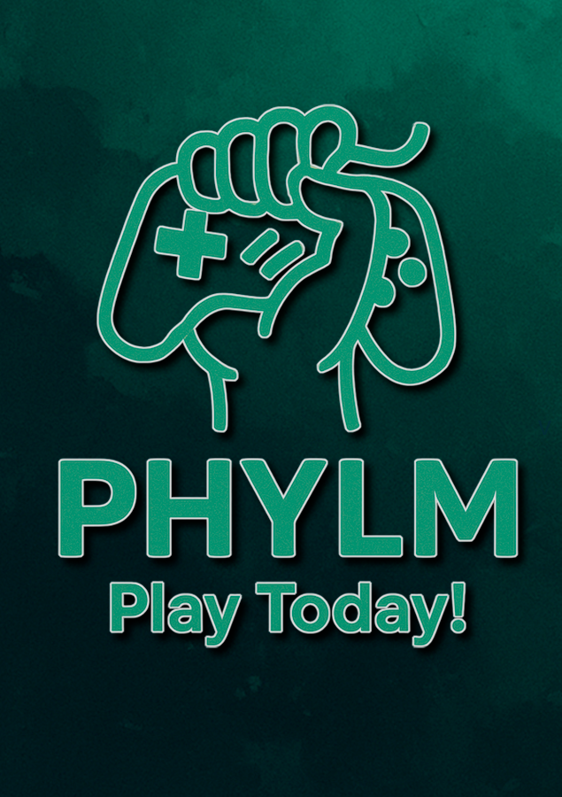
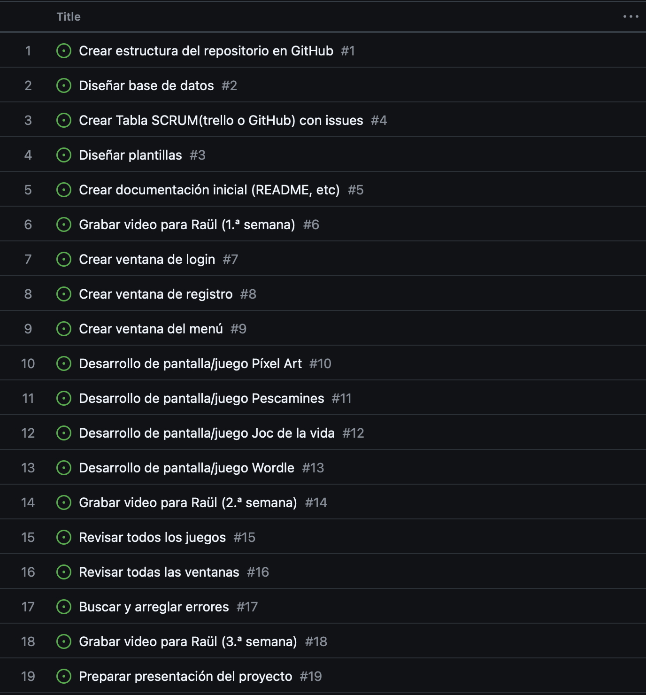

# 📘 DOCUMENTACIÓ DEL PROJECTE: *Jo(F)X*

---

## 👤 1. Descripció General

**Jo(F)X** és una aplicació amb interfície gràfica feta en **JavaFX** on els usuaris es poden **registrar i iniciar sessió**. Un cop autenticats, poden accedir a una selecció de quatre miniaplicacions:

* 🎨 **Píxel Art**: eina per dibuixar amb píxels com si fos una quadrícula.
* 💣 **Pescamines**: versió gràfica del clàssic joc de mines.
* 🌱 **Joc de la Vida**: simulació de l’autòmat cel·lular de Conway.
* 🌤️ **Wordle**: versió pròpia del joc de paraules.

---

## 🛠️ 2. Tecnologies Utilitzades

* **Java** (JDK 21)
* **JavaFX 21.0.7** per la interfície gràfica
* **Base de dades** (MariaDB)
* **JDBC** per la connexió a la base de dades
* Tot es compila manualment amb el IDE Eclipse

---

## 🗂️ 3. Estructura del Projecte

```plaintext
🗁 MiniJocsFX
 ├️ 🗂 src/
 │ ├️ 🗂 imgs/            → Imatges, icones, sons
 │ ├️ 🗂 auth/            → Login, registre, gestió d'usuaris (amb BBDD)
 │ ├️ 🗂 ui/              → Pantalles i navegació general
 │ ├️ 🗂 pixelart/        → Mòdul del joc Píxel Art
 │ ├️ 🗂 minesweeper/     → Mòdul del joc Pescamines
 │ ├️ 🗂 jocvida/         → Joc de la Vida (Game of Life)
 │ ├️ 🗂 wordle/          → Joc Wordle
 │ └️ 📜 Main.java        → Inici de l'aplicació
 │ scriptCreateJoFX.sql  → Script creació de BBDD
 └️ README.md
```

---

---

## 🗄️ 4. UML per a BBDD



---

---

## ✏️ 5. Paleta de colors

🎨 Paleta de Colors MiniJocsFX

<ul>
  <li><span style="background-color:#2a7963;color:white;padding:2px 6px;border-radius:4px;">#2a7963</span> → Verd Clar (Botó Accedir, enllaç)</li>
  <li><span style="background-color:#0d262e;color:white;padding:2px 6px;border-radius:4px;">#0d262e</span> → Blau Obscur (Background/Fons)</li>
  <li><span style="background-color:#365057;color:white;padding:2px 6px;border-radius:4px;">#365057</span> → Blau Clar (Camps d’Escriure)</li>
  <li><span style="background-color:#e8e8e8;color:#000;padding:2px 6px;border-radius:4px;">#e8e8e8</span> → Blanc Brut (Text que pareix blanc)</li>
  <li><span style="background-color:#141414;color:white;padding:2px 6px;border-radius:4px;">#141414</span> → Gris Obscur (Text Botó Enrere)</li>
  <li><span style="background-color:#e4a81d;color:black;padding:2px 6px;border-radius:4px;">#e4a81d</span> → Groc Càlid (Wordle)</li>
  <li><span style="background-color:#43a047;color:white;padding:2px 6px;border-radius:4px;">#43a047</span> → Verd Potent (Wordle)</li>
</ul>

---

## ✏️ 6. Disseny de l’app

<figure>
  <figcaption>Imatge de fons</figcaption>
  
</figure>
<figure>
  <figcaption>Logotip del programa (combinació amb les lletres dels membres)</figcaption>
  
</figure>
<figure>
  <figcaption>Aspecte de referencia de les finestres (al final podria ser diferent)</figcaption>
  
</figure>
<figure>
  <figcaption>Finestra Registre</figcaption>
  
</figure>
<figure>
  <figcaption>Finestra del Menu principal de cada usuari</figcaption>
  
</figure>
<figure>
  <figcaption>Finestres Joc de la Vida</figcaption>
  
</figure>
<figure>
  
</figure>
<figure>
  <figcaption>Finestres PixelArt</figcaption>
  
</figure>
<figure>
  
</figure>
<figure>
  <figcaption>Finestres Pescamines</figcaption>
  
</figure>
<figure>
  
</figure>
<figure>
  <figcaption>Finestra Wordle</figcaption>
  
</figure>

---

## 🔐 7. Sistema d’Usuari

* Els usuaris es registren i les dades es guarden a la **base de dades**.
* El sistema comprova les credencials amb JDBC.
* Si la connexió és correcta, l’usuari accedeix al **menú principal**.

---

## 🎮 8. Jocs Inclosos

### 1. Píxel Art

* L’usuari pot pintar en una graella de cel·les.
* Opcions de color, reinici i guardat/exportació.

### 2. Pescamines

* Joc de mines amb interfície gràfica.
* S'actualitza el tauler en cada clic.

### 3. Joc de la Vida (Conway)

* L’usuari configura una disposició inicial i veu la simulació.

### 4. Wordle

* Joc on cal endevinar una paraula en 6 intents.
* El sistema mostra si una lletra està ben col·locada, existeix o no.

---

## ⚙️ 9. Compilació i Execució

### Si es fa des de terminal:

```bash
javac --module-path /ruta/javafx-sdk-21.0.7/lib --add-modules javafx.controls,javafx.fxml -d bin src/Main.java
```

```bash
java --module-path /ruta/javafx-sdk-21.0.7/lib --add-modules javafx.controls,javafx.fxml -cp bin Main
```

---

## ✏️ 10. To-Do


---
## 👨‍💻 11. Autors

* Nom: Lluis, Helena, Patryk, Yordan, Moha
* Data: Maig 2025
